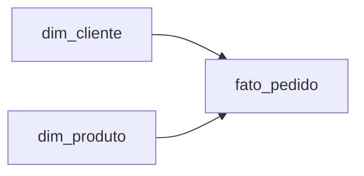

# Gold

> Notebook: `04_silver_to_gold.ipynb`

Constrói o **Star Schema** a partir do Silver, em Delta Lake.



| Tabela | Tipo | Chave |
|--------|------|-------|
| `dim_cliente` | Dimensão | `cliente_id` |
| `dim_produto` | Dimensão | `produto_id` |
| `fato_pedido` | Fato | `pedido_id` |

A fato `fato_pedido` guarda as métricas (`quantidade`, `valor_total`), o `status` e os atributos de
tempo derivados de `data_pedido` (`ano`, `mes`, `dia`).

```python
fato_pedido = (
    pedidos
        .select(
            col("id").alias("pedido_id"),
            col("cliente_id"),
            col("produto_id"),
            col("data_pedido"),
            year(col("data_pedido")).alias("ano"),
            month(col("data_pedido")).alias("mes"),
            dayofmonth(col("data_pedido")).alias("dia"),
            col("quantidade"),
            col("valor_total"),
            col("status"),
            current_timestamp().alias("gold_created_at")
        )
)
```

Detalhes do modelo em [Modelo Dimensional](../modelo-dimensional.md).
