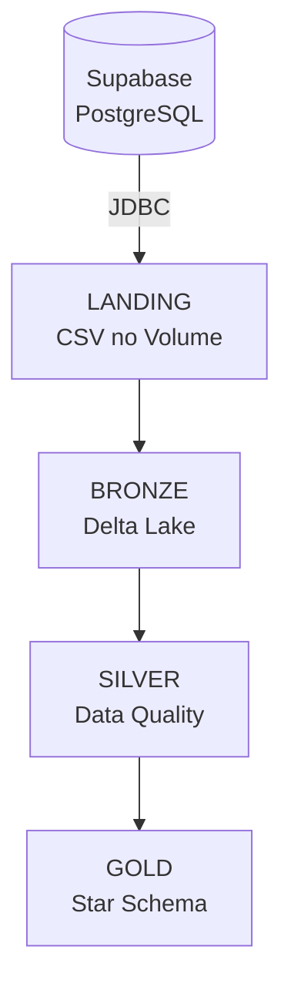

# Visão Geral

A **Arquitetura Medalhão** organiza o lakehouse em camadas, refinando os dados de forma incremental
da ingestão bruta (Landing) até o modelo pronto para consumo (Gold).

## Fluxo

## Camadas

| Camada | Conteúdo | Notebook |
|--------|----------|----------|
| **Landing** | Cópia bruta da origem em CSV (Volume) | `01_extract_supabase_to_landing.ipynb` |
| **Bronze** | Cópia das tabelas em Delta Lake | `02_landing_to_bronze.ipynb` |
| **Silver** | Dados limpos, padronizados e validados | `03_bronze_to_silver.ipynb` |
| **Gold** | Modelo dimensional (star schema) | `04_silver_to_gold.ipynb` |

O notebook `05_reset.ipynb` é um utilitário para limpar o ambiente e recomeçar.

Os schemas (`landing`, `bronze`, `silver`, `gold`) e o Volume da Landing são criados no início do
notebook `01_extract_supabase_to_landing.ipynb`.
