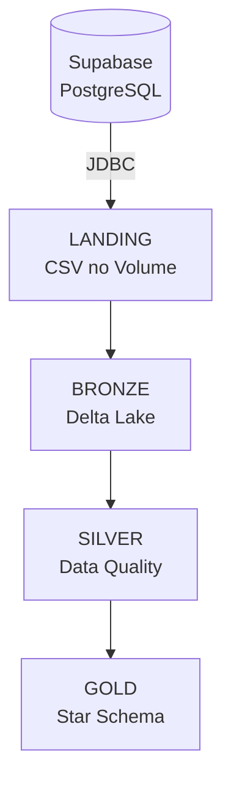

# Trabalho 3 — Lakehouse com Databricks e Arquitetura Medalhão

Pipeline de dados no **Databricks Free Edition** que implementa a **Arquitetura Medalhão**
(Landing → Bronze → Silver → Gold), extraindo um banco PostgreSQL hospedado no **Supabase** e
orquestrando as etapas via **Jobs & Pipelines**.

## Pipeline

## Conteúdo

- [Visão Geral](arquitetura/visao-geral.md)
- [Landing](arquitetura/landing.md)
- [Bronze](arquitetura/bronze.md)
- [Silver](arquitetura/silver.md)
- [Gold](arquitetura/gold.md)
- [Modelo Dimensional](modelo-dimensional.md)
- [Jobs & Pipelines](jobs-pipelines.md)

## Tecnologias

- Databricks Free Edition (serverless)
- Apache Spark (PySpark)
- Delta Lake
- Unity Catalog (schemas e Volumes)
- PostgreSQL JDBC Driver
- Supabase (PostgreSQL gerenciado)

## Referências

- [Databricks Documentation](https://docs.databricks.com/)
- [Apache Spark — PySpark](https://spark.apache.org/docs/latest/api/python/index.html)
- [Delta Lake](https://docs.delta.io/latest/index.html)
- [Unity Catalog — Volumes](https://docs.databricks.com/aws/en/volumes/)
- [PostgreSQL JDBC Driver](https://jdbc.postgresql.org/documentation/)
- [Supabase — Connecting to Postgres](https://supabase.com/docs/guides/database/connecting-to-postgres)
- [Claude (Anthropic)](https://www.anthropic.com/claude) — assistente de IA usado no desenvolvimento
