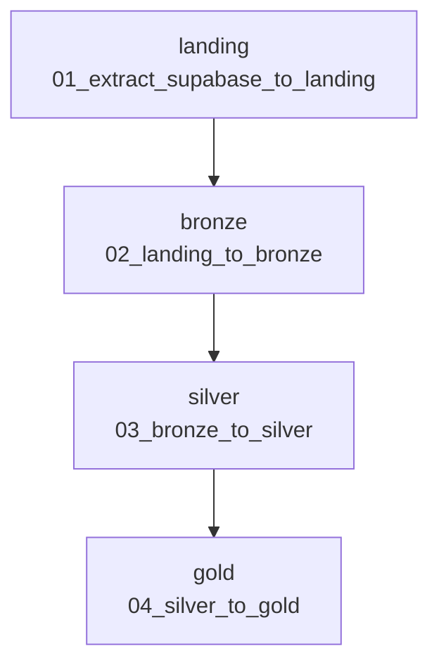

# Jobs & Pipelines

As etapas do pipeline são encadeadas em um **Job** do Databricks, executado sequencialmente.

## DAG

| Ordem | Task | Notebook | Depende de |
|-------|------|----------|------------|
| 1 | `landing` | `01_extract_supabase_to_landing` | — |
| 2 | `bronze` | `02_landing_to_bronze` | `landing` |
| 3 | `silver` | `03_bronze_to_silver` | `bronze` |
| 4 | `gold` | `04_silver_to_gold` | `silver` |

## Criação

1. **Jobs & Pipelines → Create job**.
2. Adicione uma task **Notebook** para cada etapa, apontando para o notebook correspondente.
3. Em cada task (a partir da segunda), defina **Depends on** apontando para a task anterior.
4. **Run now** para executar o pipeline de ponta a ponta.

O `05_reset.ipynb` não faz parte do Job — é executado manualmente para limpar o ambiente.
