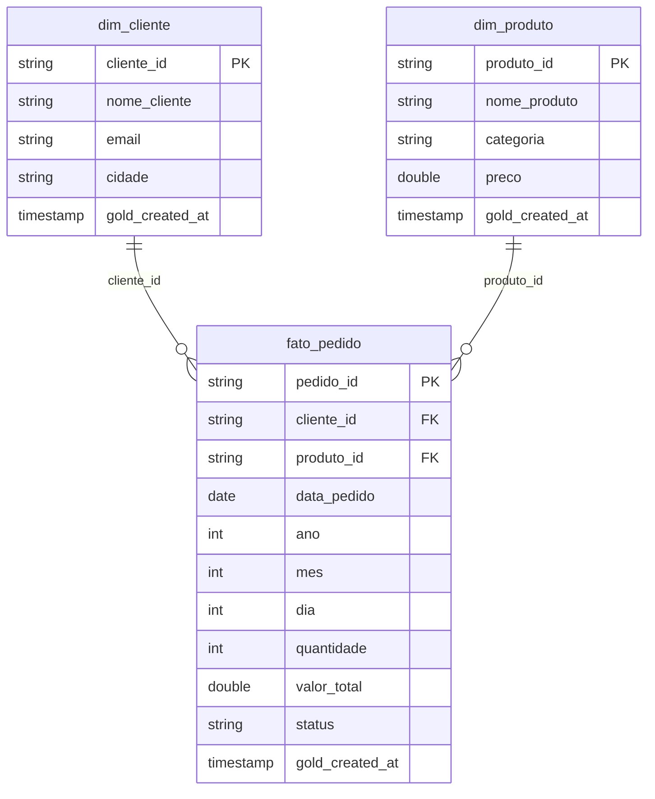

# Modelo Dimensional

Star Schema da camada Gold: uma fato central cercada por dimensões.



## `fato_pedido`

| Coluna | Tipo | Descrição |
|--------|------|-----------|
| `pedido_id` | string | Chave do pedido |
| `cliente_id` | string | FK → `dim_cliente` |
| `produto_id` | string | FK → `dim_produto` |
| `data_pedido` | date | Data do pedido |
| `ano` / `mes` / `dia` | int | Atributos de tempo |
| `quantidade` | int | Métrica |
| `valor_total` | double | Métrica |
| `status` | string | Status do pedido |
| `gold_created_at` | timestamp | Auditoria |

## `dim_cliente`

| Coluna | Descrição |
|--------|-----------|
| `cliente_id` | Chave do cliente |
| `nome_cliente` | Nome |
| `email` | E-mail |
| `cidade` | Cidade |

## `dim_produto`

| Coluna | Descrição |
|--------|-----------|
| `produto_id` | Chave do produto |
| `nome_produto` | Nome |
| `categoria` | Categoria |
| `preco` | Preço |

## Consulta de exemplo

```sql
SELECT
    c.cidade,
    COUNT(f.pedido_id) AS total_pedidos,
    SUM(f.valor_total) AS receita_total
FROM workspace.gold.fato_pedido f
JOIN workspace.gold.dim_cliente c ON f.cliente_id = c.cliente_id
GROUP BY c.cidade
ORDER BY receita_total DESC;
```
